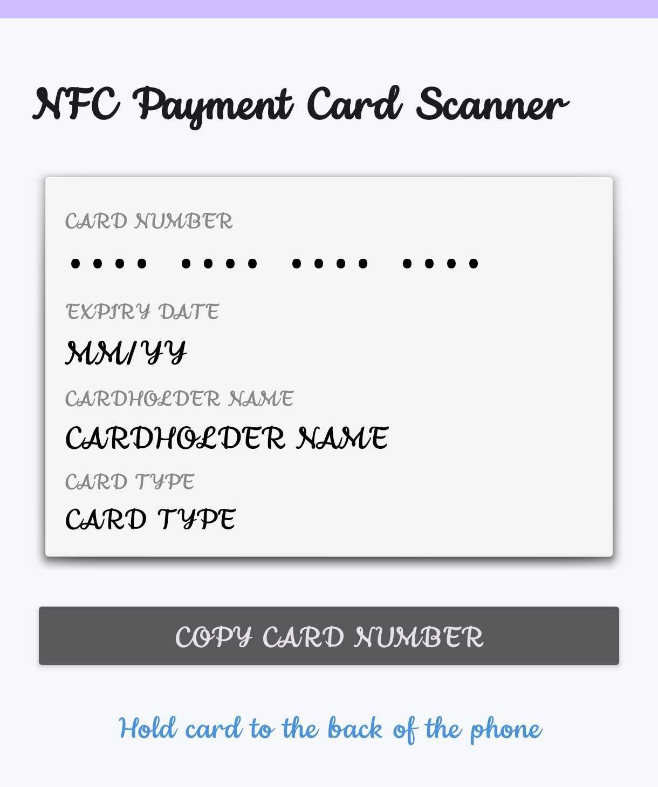
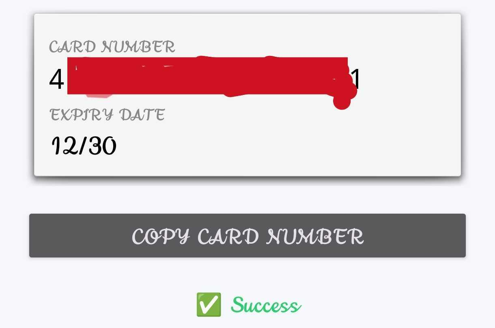

# NFC Payment Card Reader
 Reads and Decodes Card Number, Expiry, Cardholder's Name and Card Type fields from a payment card via the NFC module of an Android device.  
 
 ***Note: Most card issuers will suppress the cardholder's name from the card.***

 ## Downloads
 - Download the latest release of the application [here](https://github.com/7Ragnarok7/NFC-Payment-Card-Reader/releases/tag/v1)  
 - Latest Version: 2.0  
 - Updates in v2.0: Added support to read the Cardholder's Name and Card Type.

 ## Interface
   

 ----
 
 

 ## Limitations
 This tool is made for Android devices only due to the behavioural and [security constraints](https://developer.apple.com/documentation/corenfc/nfcpaymenttagreadersession) in IOS devices.

 ## Disclaimer
 This tool is provided strictly for educational and ethical research purposes, such as learning about NFC technology, understanding EMV protocols and penetration testing with proper authorization.
 I explicitly prohibit and disclaim all responsibility for any use of this application in the context of:

    Illegal Activities: Any action that violates local, national, or international laws, including but not limited to financial fraud, theft, identity theft, or unauthorized access to personal data.
    Unauthorized Access: Reading or copying data from any card without the express permission of the cardholder.

 The developer assumes no liability for misuse. Users of this application are solely responsible for compliance with all applicable laws and ethical standards.

 ## Reference(s)
 - EVM NFC paycard enrollment JAVA Library: https://github.com/devnied/EMV-NFC-Paycard-Enrollment  
 - ISO-7816: https://en.wikipedia.org/wiki/ISO/IEC_7816
